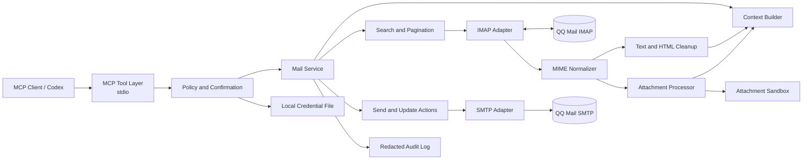
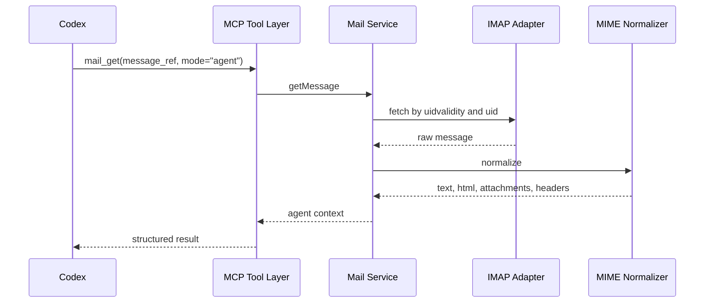
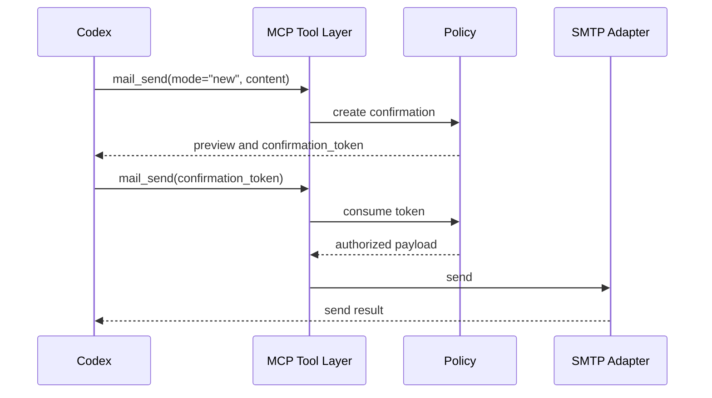

# 系统架构

## 1. 架构目标

系统负责把 QQ 邮箱协议转化为稳定、可审计、适合 AI 使用的邮件上下文和原子动作。核心复杂度隔离在协议适配和 MIME 规范化层，MCP 工具层保持薄和明确。

## 2. 总体架构



## 3. 模块职责

| 模块 | 职责 | 不负责 |
|---|---|---|
| MCP Tool Layer | 工具注册、Schema 校验、结果编码 | 协议细节、邮件解析 |
| Policy | 权限、确认令牌、串行化与安全边界 | 邮件业务查询 |
| Mail Service | 编排搜索、读取、发送和更新 | 直接实现 IMAP/SMTP |
| Context Builder | 去重、截断、引用整理、AI 上下文 | 调用模型做推理 |
| IMAP Adapter | 登录、LIST、SEARCH、FETCH、STORE、MOVE | 发信和 HTML 清洗 |
| SMTP Adapter | 认证、MIME 组装、发送 | 邮箱搜索和状态修改 |
| MIME Normalizer | 多段解析、编码解码、正文和附件拆分 | 权限判断 |
| Credential Store | 授权码安全保存和读取 | 配置界面 |
| Audit | 脱敏操作记录 | 保存邮件正文 |

## 4. 关键数据模型

### 4.1 Message Ref

邮件对外暴露不透明的 `message_ref`。内部至少包含：

```text
folder
uidvalidity
uid
message_id optional
```

UID 只在特定 `uidvalidity` 下有效，因此任何读取和修改都不能只保存 UID。

### 4.2 Cursor

分页游标至少包含：

```text
query_hash
folder
uidvalidity
last_uid
generated_at
```

游标用于稳定翻页，不承诺在外部客户端大规模删除邮件后仍保持完全一致。

### 4.3 Agent Context

AI 上下文包含：

```text
message_ref
thread_ref
subject
from
to
cc
date
text
html_clean optional
quoted_history optional
attachments
links
warnings
truncated
next_cursor
is_untrusted
```

## 5. 关键流程

### 5.1 读取邮件



### 5.2 确认后发送



### 5.3 邮件修改

1. 解析并验证 `message_ref`。
2. 重新检查当前 `uidvalidity`。
3. 检查权限和确认要求。
4. 执行优先操作。
5. 必要时使用安全回退。
6. 返回规范化结果和审计标识。

## 6. 连接与并发

V1 只有一个账号，因此采用单进程、单账号模型。

- IMAP 连接由内部串行队列访问，避免协议状态竞争。
- 搜索和读取可以复用同一连接，但不能并发切换 mailbox。
- 服务层同样使用串行队列，防止写操作交叉；单次只读操作有连接和 socket 超时。
- SMTP 每条发送使用独立短连接或受控连接。
- 操作超时后不自动重放发送。
- 服务启动时按需连接，不强制常驻长连接。

## 7. 安全边界

- 邮件内容是不可信输入。
- 工具参数必须经过 Schema 和业务规则双重校验。
- 附件只能写入配置的沙箱根目录。
- HTML 清洗后移除脚本、事件属性、表单和默认远程资源。
- 链接只以文本和 URL 返回，访问链接必须由用户另行确认。
- 授权码优先从本地加密凭据文件读取，开发环境可回退到环境变量。

## 8. 存储策略

V1 不需要数据库。运行期保存：

- 进程内确认令牌
- 进程内能力探测结果
- 本地日志
- 沙箱附件

后续只有在明确需要跨会话搜索或大邮箱优化时，才引入 SQLite 索引。

## 9. 部署形态

- 本地可执行 Node.js 进程
- MCP stdio 传输
- 无公网监听端口
- 无远程数据库
- 通过客户端配置启动

## 10. 可测试性

- IMAP、SMTP、凭据存储和文件系统都通过接口注入。
- MIME 规范化使用固定样例做单元测试。
- 工具层使用 fake adapters 做契约测试。
- 真实 QQ 邮箱测试放在独立集成测试中，默认不进入普通 CI。
