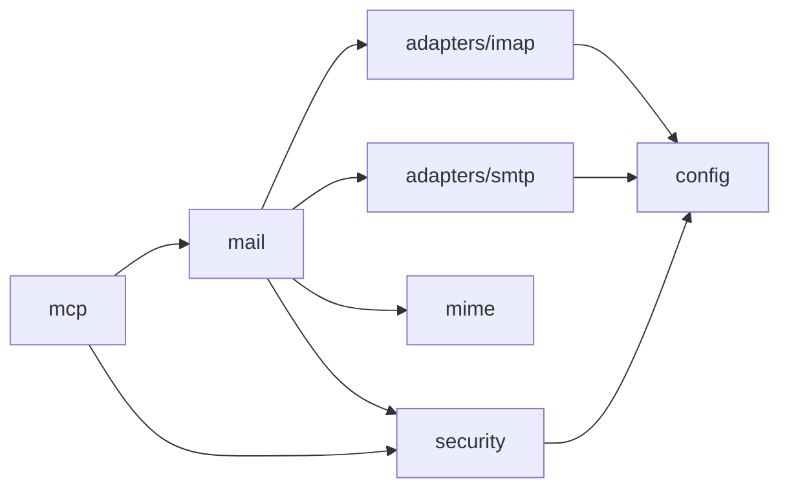

# 项目结构

## 1. 目标结构

```text
qq_email_mcp/
├── README.md
├── .editorconfig
├── .gitignore
├── docs/
│   ├── README.md
│   ├── PRD.md
│   ├── architecture.md
│   ├── project-structure.md
│   ├── mcp-tools.md
│   └── adr/
│       └── 0001-single-account-imap-smtp.md
├── src/
│   ├── mcp/
│   ├── mail/
│   ├── adapters/
│   ├── mime/
│   ├── security/
│   └── config/
├── tests/
│   ├── unit/
│   ├── integration/
│   └── e2e/
├── scripts/
├── config/
│   └── config.example.toml
└── logs/
```

## 2. 目录职责

| 目录 | 放置内容 | 不放置内容 |
|---|---|---|
| `docs/` | PRD、架构、工具契约、ADR、维护指南 | 运行日志、密钥、临时草稿 |
| `src/mcp/` | MCP Server、工具注册、Schema、结果编码 | IMAP 和 SMTP 实现 |
| `src/mail/` | 邮件业务编排、搜索、读取、发送、更新 | 协议连接细节 |
| `src/adapters/` | IMAP/SMTP 会话、邮箱操作、MIME 组装和发送 | 邮件业务规则 |
| `src/mime/` | MIME 解析、正文规范化、附件处理 | 权限判断 |
| `src/security/` | 凭据、确认令牌、沙箱、脱敏 | 邮件业务查询 |
| `src/config/` | 配置模型、加载、校验 | 密钥明文存储 |
| `tests/unit/` | 纯函数和单模块测试 | 真实网络调用 |
| `tests/integration/` | IMAP/SMTP fake 及适配器集成测试 | 产品验收 |
| `tests/e2e/` | 真实或准真实 MCP 流程测试 | 单元测试 |
| `scripts/` | 构建、检查、发布和开发辅助脚本 | 运行时业务代码 |
| `config/` | 非敏感配置样例 | 授权码和用户数据 |
| `logs/` | 本地日志目录 | 仓库内长期日志 |

## 3. 依赖方向



规则：

- 外层可以依赖内层，内层不能反向依赖外层。
- `mcp` 不直接调用 `adapters`。
- `mail` 定义业务接口，协议适配器实现接口。
- `mime` 不访问网络、不读取配置、不执行操作。
- `config` 不依赖任何业务模块。

## 4. 命名规则

- 目录和文件使用小写 kebab-case。
- TypeScript 类型和类使用 PascalCase。
- 变量和函数使用 camelCase。
- 文档使用大写产品缩写或小写 kebab-case，例如 `PRD.md`、`project-structure.md`。
- ADR 使用四位编号，例如 `0002-attachment-sandbox.md`。

## 5. 放置决策

新增内容时按以下顺序判断：

1. 是产品、架构或决策文档吗？放入 `docs/`。
2. 是外部协议实现吗？放入对应 adapter 目录。
3. 是跨模块业务编排吗？放入 `src/mail/`。
4. 是安全、凭据或确认逻辑吗？放入 `src/security/`。
5. 是测试吗？按测试范围放入 `tests/`。
6. 是构建或维护命令吗？放入 `scripts/`。
7. 是配置样例吗？放入 `config/`，且不能包含真实凭据。

## 6. 根目录约束

根目录只保留：

- 项目入口 `README.md`
- 通用编辑器与忽略配置
- 工程清单文件
- 顶层标准目录

不在根目录新增功能说明、接口草稿、测试报告或临时设计文件。

`package.json` 当前保留 `private: true`。如果项目后续需要公开发布，必须先显式确认包名、许可证和发布策略，再移除该字段。
